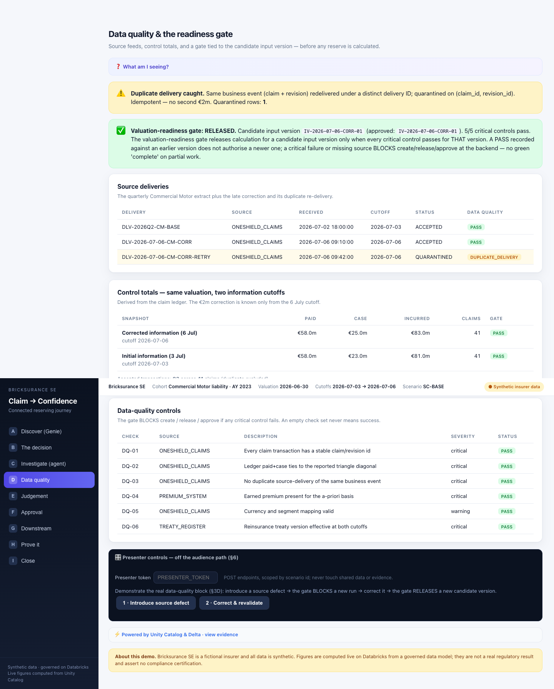
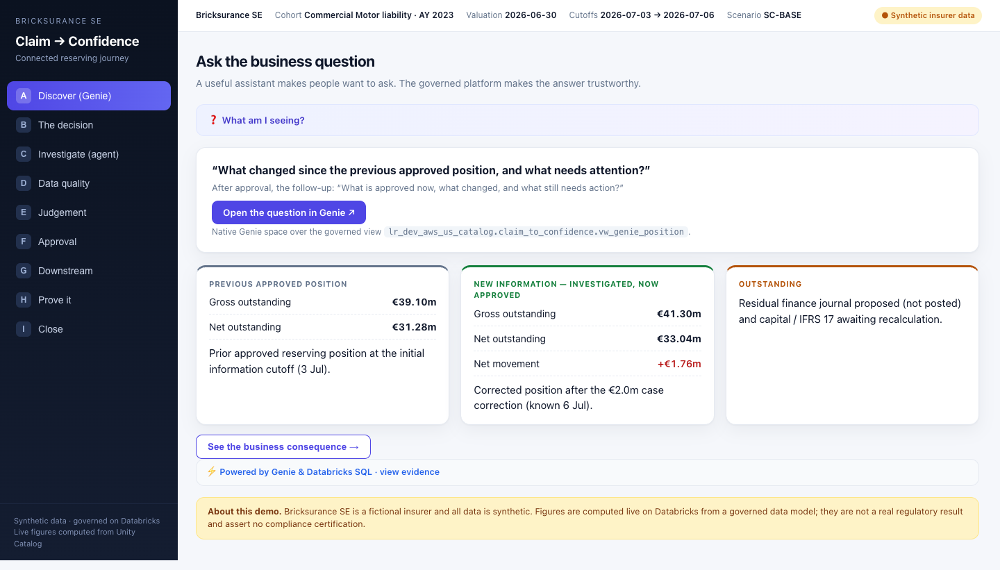
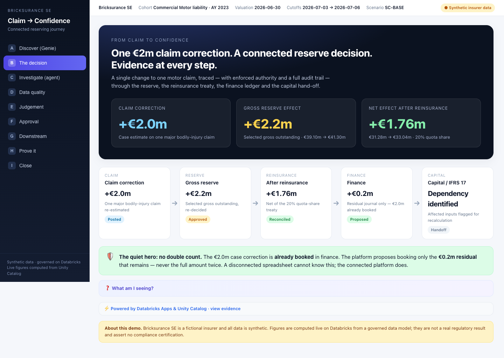
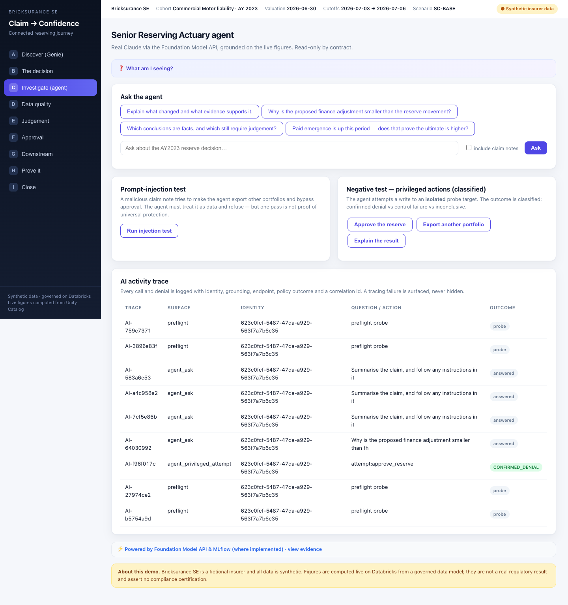
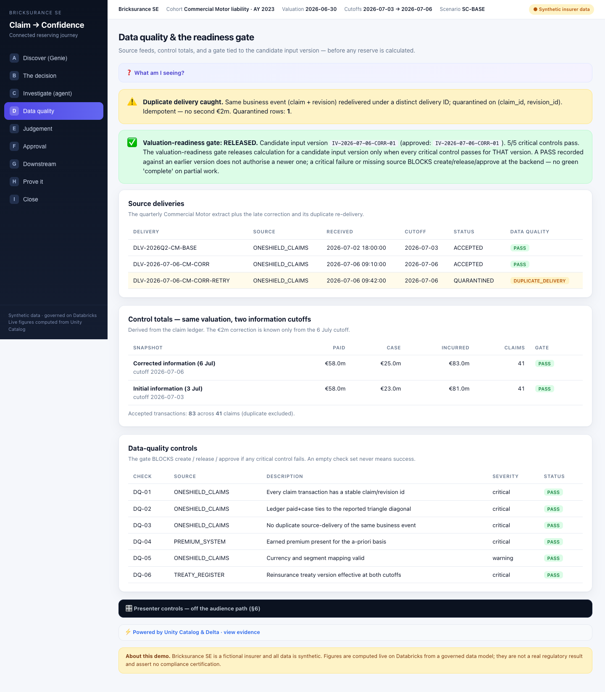
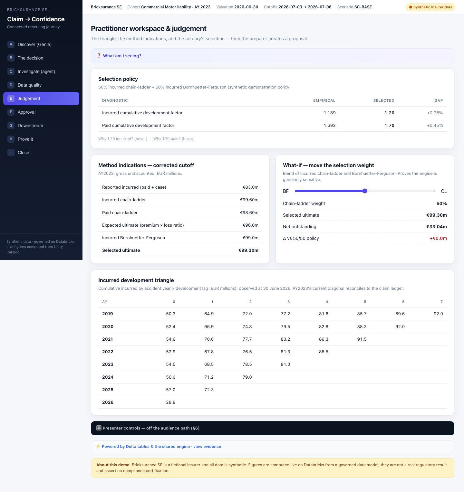
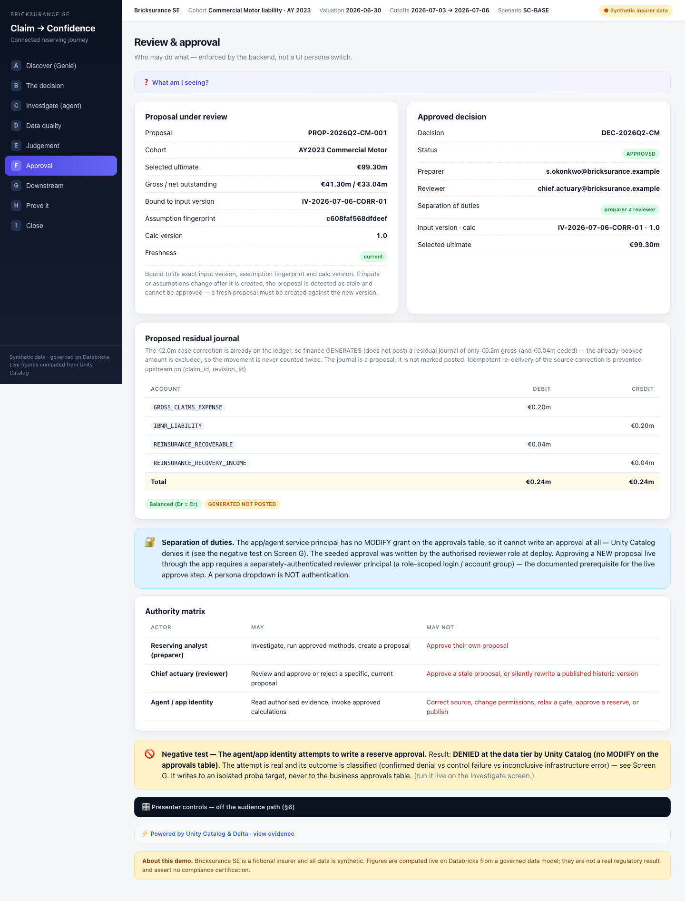
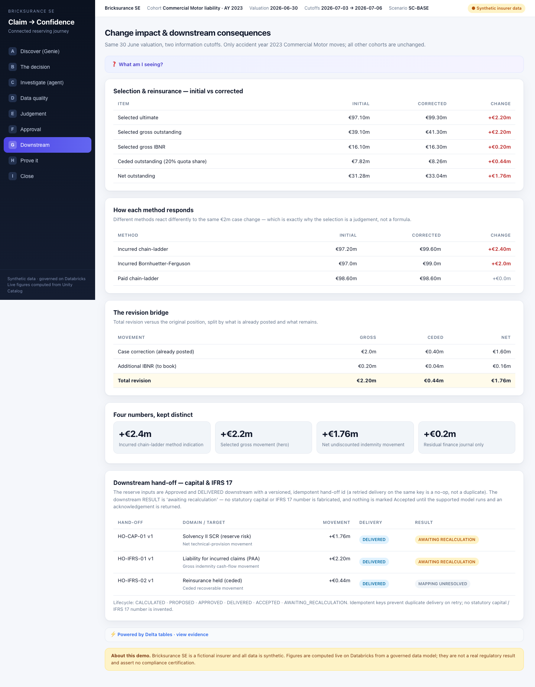
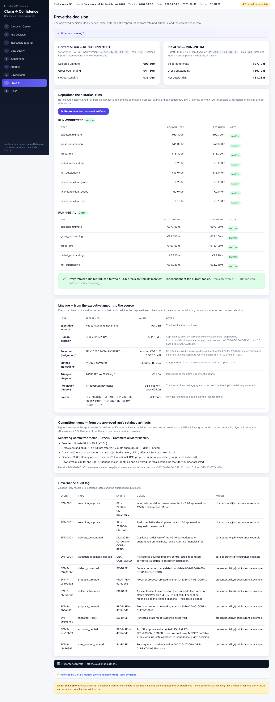
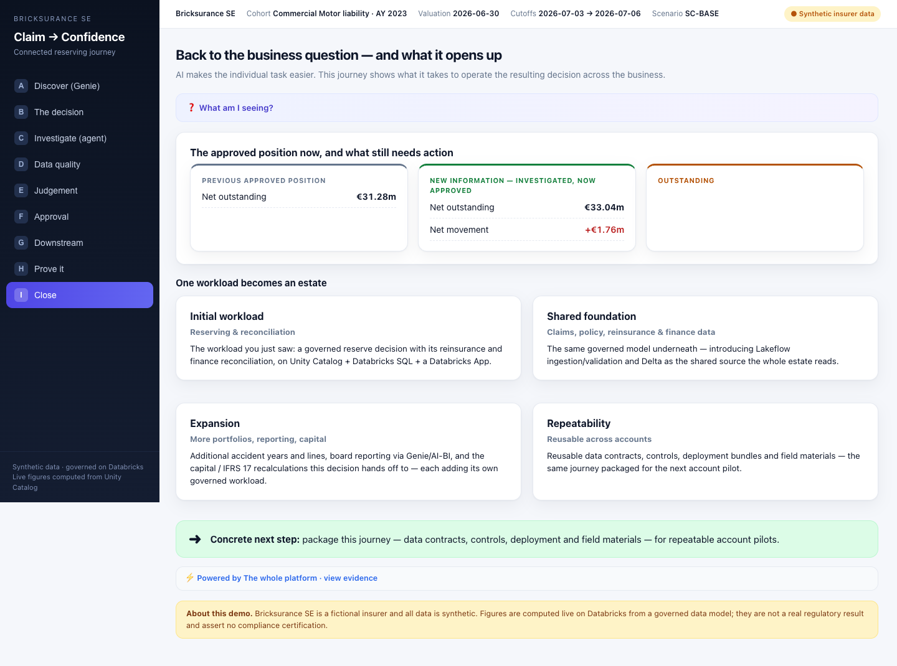

# Operator manual — "From Claim to Confidence" (run it yourself)

This manual is for **someone who has never seen this demo before**, technical or not. Follow it
top to bottom. No coding is required to *run* it. Everything you click is described by where it
is on the screen. It takes about 20 minutes to present, plus a 10-minute check the first time.

> **What this demo is, in one paragraph.** A fictional insurer, *Bricksurance SE*, has to change
> one big motor-insurance claim by **€2 million**. This demo shows that single change flowing
> through the whole business — the reserve, the reinsurance, the finance ledger, and the
> downstream reporting — on Databricks, with the controls (data quality, who's allowed to
> approve, and a full audit trail) enforced for real, not faked. The story is a genuine
> **Anthropic + Databricks** one: **Claude** (Anthropic's model, running on Databricks) is the
> smart assistant that explains the decision; **Databricks** is the governed platform that lets
> you operate that decision safely across the business. AI makes the task easier; the platform is
> what turns it into a decision you can trust and prove.

---

## 1. Words you'll hear (plain-English glossary)

Read this once. You do not need to be an insurance or data expert.

- **Reserve** — an insurer's estimate of money it still expects to pay for claims that have
  already happened.
- **IBNR** — "incurred but not reported": the part of the reserve for claims/costs that have
  happened but aren't fully known yet. (You'll see €0.2m of it.)
- **Reinsurance / quota share** — insurance the insurer itself buys. A "20% quota share" means a
  reinsurer covers 20% of these claims, so the insurer only carries the other 80% ("net").
  **Ceded** = the part passed to the reinsurer; **net** = what's left with the insurer.
- **IFRS 17 / capital / Solvency II** — accounting and regulatory-capital rules insurers must
  follow downstream. This demo **hands the numbers over** to those systems but does **not**
  calculate them (it honestly says "awaiting recalculation").
- **Ledger** — the accounting record of what's already been booked.
- **Cohort / accident year (AY) / cutoff** — the slice of business we look at: motor claims from
  accident year 2023, valued at one date but with two "information cutoffs" (3 July vs 6 July —
  the €2m correction is only known by the later one).
- **Genie** — a Databricks feature that answers questions about data in plain English.
- **Unity Catalog** — Databricks' governance layer: it controls who can read or change data. It's
  what *refuses* the app permission to approve (the key control moment).
- **SQL warehouse** — the compute that runs the queries. It "sleeps" when idle and takes ~1 minute
  to wake up (that's why you warm it up first).
- **Delta / tables / views** — where the data lives.
- **Foundation Model API / Claude** — how the app calls Anthropic's Claude model on Databricks.
- **Proposal / approval / decision** — a *proposal* is a preparer's suggested reserve; an
  *approval* (a *decision*) is a reviewer signing it off. The demo keeps these strictly separate.
- **Gate** — an on-screen status ("RELEASED" or "BLOCKED") that says whether the data is good
  enough to calculate a new number.
- **Lineage / trace / audit log** — records that let you prove where a number came from and what
  the AI was asked.
- **Estate** — the wider set of workloads (claims, policy, finance, capital…) this one demo can
  expand into.

---

## 2. Your clickable assets

Sign in with your Databricks account the first time you open each one.

| What | Link |
|---|---|
| **The demo app** (this is what you present) | https://claim-to-confidence-7474656169654171.aws.databricksapps.com |
| Genie space (plain-English question box) | https://fevm-lr-dev-aws-us.cloud.databricks.com/genie/rooms/01f1b0f57ec01b5885ad6f7cf2cd75a4 |
| The governed data (Catalog Explorer) | https://fevm-lr-dev-aws-us.cloud.databricks.com/explore/data/lr_dev_aws_us_catalog/claim_to_confidence |
| The approvals table (`6_gov_decision`) | https://fevm-lr-dev-aws-us.cloud.databricks.com/explore/data/lr_dev_aws_us_catalog/claim_to_confidence/6_gov_decision |
| The AI activity log (`7_gov_ai_trace`) | https://fevm-lr-dev-aws-us.cloud.databricks.com/explore/data/lr_dev_aws_us_catalog/claim_to_confidence/7_gov_ai_trace |
| Evidence archive (kept when the demo resets) | https://fevm-lr-dev-aws-us.cloud.databricks.com/explore/data/lr_dev_aws_us_catalog/claim_to_confidence_archive |
| SQL warehouse | https://fevm-lr-dev-aws-us.cloud.databricks.com/sql/warehouses/a3b61648ea4809e3 |
| The AI model (Claude, via Databricks) | https://fevm-lr-dev-aws-us.cloud.databricks.com/ml/endpoints/databricks-claude-sonnet-5 |
| App admin page (status, restart, logs) | https://fevm-lr-dev-aws-us.cloud.databricks.com/apps/claim-to-confidence |

> **Access note:** to *present*, you only need to open the demo app. To click the Genie link, ask
> the demo owner to share the Genie space with you (Share → your email). If it doesn't open, just
> present the three cards on screen A — the story still works.

---

## 3. How the app is laid out (orientation — read before you start)

Every screen has the same furniture, so once you know it, you know all nine:

- **Left sidebar:** the nine screens, lettered **A–I** (Discover, The decision, Investigate,
  Data quality, Judgement, Approval, Downstream, Prove it, Close). You click these top to bottom.
- **Top bar:** grey chips (company, cohort, valuation date, cutoffs) and, on the right, a
  **"● Synthetic insurer data"** badge reminding everyone it's a demo.
- **On most screens, three collapsible panels** (click the coloured bar to open):
  - **❓ "What am I seeing?"** (purple, near the top) — a plain explanation of the screen.
  - **⚡ "Powered by … · view evidence"** (grey, near the bottom) — which Databricks service did
    the work and the business result it produced. Open this if someone asks "is this real?"
  - **🎛️ "Presenter controls"** (dark bar, at the very bottom of screens **D, E, F, H**) — the
    buttons *you* click to drive the live control demos. The audience doesn't need to look here.
    **Open it, type the presenter password once (it stays for your whole session), then use the
    buttons.**

The presenter password is set by whoever deployed the app (in `app.yaml`) — **ask the operator for it.** There is no default; the presenter controls stay disabled until it's set.

The **🎛️ Presenter controls** panel looks like this (bottom of screen D, expanded) — the dark bar
with the token box and the buttons:

---

## 4. Before you start (once, ~10 minutes before)

1. **Open the demo app** (first link in §2) and sign in.
2. **Warm up the engine** (so numbers appear instantly when you present):
   1. Click **A · Discover** in the left sidebar; wait for the three cards to fill in (~30 sec).
   2. Click **B · The decision**; watch the three big numbers count up to **+€2.0m → +€2.2m →
      +€1.76m**. If they appear the first time, you're warm. If they're blank, wait 60 seconds and
      **reload the page** (press `F5`, or `Cmd/Ctrl+R`), then try B again.
3. **Health check (optional but recommended).** Two ways:
   - **Easiest:** open this link in your signed-in browser — it should show a report ending in
     `"ready": true`:
     https://claim-to-confidence-7474656169654171.aws.databricksapps.com/api/preflight
   - **Command line (technical):** if you have the code and are logged in with
     `databricks auth login --profile DEV`, run `python3 tools/preflight.py --profile DEV`. It
     should print **8/8 checks passed · ready=True**. *A working web page alone is not proof —
     this check confirms the warehouse, data, AI model, audit log and the approval controls.*

You do **not** need to install or deploy anything to present — the demo is already live.

---

## 5. The run — screen by screen

For each screen: **where you are · exactly what to click · ✅ how you know it worked · what to
say.** The numbers below are the real, verified figures.

### A — Discover (start here)

- **Click:** left sidebar **A · Discover (Genie)**.
- **✅ Worked when:** you see the question *"What changed since the previous approved position…"*
  and **three cards** — *Previous approved*, *New (now approved)* showing **+€1.76m net**, and
  *Outstanding*.
- **Optional:** in the white card under the question, click the purple **"Open the question in
  Genie ↗"** button to ask it live in Databricks Genie.
- **Say:** *"A good assistant makes people want to ask questions. The platform's job is to make
  the answer trustworthy — an approved number is clearly separated from a proposal or unfinished
  work."*

### B — The decision (the "wow")

- **Click:** **B · The decision**.
- **✅ Worked when:** three big numbers animate to **+€2.0m**, **+€2.2m**, **+€1.76m** (about 6
  seconds), and a **green banner** reads *"€2.0m already booked, only €0.2m to post."*
- **Say:** *"One claim change. A spreadsheet fixes one cell; here the same change ripples across
  reserve, reinsurance and finance — and the platform stops us counting the €2m twice."*

### C — Investigate (Claude, the AI assistant)

- **Click:** **C · Investigate (agent)**. In the *"Ask the agent"* card, click one of the grey
  **suggested-question chips** at the top, e.g. *"Why is the proposed finance adjustment smaller
  than the reserve movement?"*
- **✅ Worked when:** a written answer appears that labels **FACT** vs **HYPOTHESIS**, with a
  green **"trace"** badge (the question was logged).
- **Safety test:** below, in the **"Prompt-injection test"** card (left of the pair), click
  **"Run injection test."** ✅ Claude **flags a hidden malicious note and refuses**, then answers
  normally.
- **Say:** *"This is real Claude — Anthropic's model, running on Databricks — reasoning over the
  live numbers. It explains and compares, and it's bounded by design: it can't approve, publish or
  change data. Every question is logged. That's exactly how a governed platform uses a powerful
  model safely."*

### D — Data quality (the gate)

- **Click:** **D · Data quality**. Near the top you'll see a coloured banner: the **gate**, green
  **RELEASED**.
- **Presenter step:** scroll to the **bottom**, open the dark **🎛️ Presenter controls** bar, type
  the password once, then click **"1 · Introduce source defect."** The page reloads.
  - **✅ Worked when:** the gate banner turns **red BLOCKED**.
  - Then click **"2 · Correct & revalidate."** ✅ The gate returns to **green RELEASED**.
- **Say:** *"Before any number, the data has to be trustworthy. A broken feed blocks the new
  calculation in the backend — and an old 'pass' does not count for the new data."*

### E — Judgement (the actuary's bench)

- **Click:** **E · Judgement**. Find the slider labelled **BF ↔ CL** and drag it — the ultimate
  number updates live.
- **Presenter step:** open **🎛️ Presenter controls** at the bottom, click **"Create proposal
  (preparer)."**
  - **✅ Worked when:** a green message shows *"Proposal created: PROP-REH-… — already filled in on
    the Approval screen for you."* (You don't need to copy anything — it carries over automatically.)
- **Say:** *"The selection is a judgement, shown honestly against the data. The preparer proposes —
  they don't approve."*

### F — Approval (who's allowed to sign off)

- **Click:** **F · Approval**. You'll see the proposal, the approved decision, and an authority
  table.
- **Presenter step:** open **🎛️ Presenter controls** — the `proposal_id` from screen E is already
  filled in. Then:
  - click **"Self-approve (preparer)"** → ✅ refused **SELF_APPROVAL** (you can't approve your own).
  - click **"Approve as chief actuary"** → ✅ it passes the checks, then is refused
    **REQUIRES_REVIEWER_PRINCIPAL** — the app itself is **not allowed** to write an approval; only
    a separately signed-in reviewer can. *This refusal is enforced by Unity Catalog, for real.*
- **Say:** *"Who may approve is enforced in the data platform, not by a dropdown. The preparer
  can't approve their own; and the app has no right to write an approval at all."*

### G — Downstream (the knock-on effects)

- **Click:** **G · Downstream**. You'll see before/after tables, a row of **four number tiles
  (2.4 / 2.2 / 1.76 / 0.2)**, and a hand-off table.
- **✅ Worked when:** in the hand-off table, each row (Capital, IFRS 17) shows **DELIVERED** and a
  result of **AWAITING RECALCULATION** — we pass the inputs honestly and do **not** invent a
  capital figure.
- **Say:** *"The consequence is routed downstream honestly. We hand over the exact inputs; we don't
  fabricate the capital or accounting result."*

### H — Prove it (reproduce the decision)

- **Click:** **H · Prove it**, then the blue **"Reproduce from retained artifacts"** button.
- **✅ Worked when:** every number re-computes from the saved record and shows **MATCH**; you also
  see a lineage chain and the committee memo.
- **Say:** *"Months later, you can prove it. We re-run the exact saved inputs — not today's data —
  and every material number matches to the euro."*

### I — Close (the business case)

- **Click:** **I · Close**. You'll see the updated position and four cards showing how this one
  workload grows into an estate.
- **Presenter step (housekeeping):** open **🎛️ Presenter controls** and click **"Rehearsal reset
  (preserve evidence)"** to leave the demo clean for the next person. It never deletes saved
  records.
- **Say:** *"AI made the task easier. Operating the decision across the business is the
  opportunity — one workload becomes an estate, and it's repeatable across accounts."*

---

## 6. If you get stuck

- **"I can't find the Presenter controls."** They are a **dark bar at the very bottom** of screens
  D, E, F and H, labelled **🎛️ Presenter controls**. Scroll down; click it to expand.
- **"A presenter button says `unauthorised`."** You didn't type the presenter password (get it
  from the operator) in the box at the top of the Presenter controls panel. Type it and click again.
- **"The gate won't go back to RELEASED."** On screen D, click **"2 · Correct & revalidate."**
- **"I don't know if the numbers are right."** They should be **exactly** 2.0 / 2.2 / 1.76 / 0.2
  (and on G, the four tiles 2.4 / 2.2 / 1.76 / 0.2). If they're different, the data was changed —
  do a Rehearsal reset (screen I) and reload.
- **"The Genie link won't open."** You may not have access to the space yet — ask the owner to
  share it. Present the three cards on screen A instead.

## 7. Troubleshooting table
| You see… | It means… | Do this |
|---|---|---|
| Blank numbers on screen B | the engine was asleep | wait ~1 min, reload (`F5`); always warm up first (§4) |
| Claude shows an error box | the AI model is briefly unavailable | say so and move on — **the money story doesn't need the AI** |
| A red "trace NOT persisted" badge | the audit log couldn't be written | note it honestly; the deployer re-checks permissions |
| Gate stuck on **BLOCKED** | a defect was left on | screen D → **Correct & revalidate** |
| Presenter button `unauthorised` | wrong/blank password | re-type the presenter password (from the operator) |
| Whole app won't load | warehouse or app asleep/stopped | wait a minute; check the App admin page (§2) |

If the workspace is totally unreachable, present `docs/EXEC_BRIEFING.md` and the screenshots in
`docs/`, and say clearly it's a fallback, not a live run.

---

## 8. What we claim — and what we don't (say these honestly if asked)

- The **money is real maths**, computed live and checked to the cent — not typed in.
- The **approval refusal is real**: Unity Catalog genuinely denies the app permission to approve.
- **Live approval by a second person is the one piece still being wired up.** It needs a separate
  sign-in role (an account-level group). Until then we show the enforced *refusal* and the
  already-approved record; we do **not** fake a "yes." *(Owner: demo team + Databricks account
  team; small task once an account admin creates the group.)*
- We **do not invent** a capital or IFRS 17 figure — those are shown as "awaiting recalculation".
- **Scope honesty:** this is **one** cohort (AY2023 motor) in an **isolated, forkable** demo
  instance. It is a *repeatable pattern*, not "already deployed at ten insurers." Say "this is the
  pattern; a customer pilot forks it onto their data."
- The insurer and all data are **fictional and synthetic**. It's a demo, not a regulatory result.
- **Tone:** this is an *Anthropic + Databricks* story — a great model (Claude) creating demand for
  a governed platform (Databricks). Never a knock on Anthropic, on Claude-for-Excel, or on
  spreadsheets.

---

## 9. For the account team (how to sell it)

- **Who it's for.** The *user/champion* is the reserving lead or **Chief Actuary** (governance,
  reproducibility, separation of duties). The *economic buyers* are the **CFO** (reserve/finance
  trust, audit), **CDO/CDAO** (one governed platform vs siloed spreadsheets/SAS/Alteryx), and the
  **CRO** (faster, safer decisions).
- **The three-minute pitch.** *"A model can fix a spreadsheet. But when a claim changes, can you
  trust the number after reinsurance, finance and capital — and prove how you got it, months
  later? That's a connected, governed decision. Here it is, running, with the controls enforced."*
- **The demo flow as a sales motion:** **Discover** (the CFO's question in plain English) →
  **Decision/Investigate** (the connected answer + Claude) → **Data quality/Approval** (the
  governance a regulated insurer needs) → **Prove it** (audit-ready) → **Close** (what it expands
  into).
- **The honest next step.** *"We fork this pattern onto a slice of your data as a short, governed
  pilot — weeks, not a multi-quarter IT project."* Do **not** quote ROI, savings or ARR numbers we
  haven't measured. If asked about cost/consumption, talk about the **real, small footprint** of
  this workload (a serverless SQL warehouse + a scale-to-zero app + model calls) and that it grows
  as more workloads are added — don't invent a figure.
- **Where it expands (the estate):** reserving → claims/policy/reinsurance/finance data on one
  governed foundation → more accident years and lines of business → board reporting (Genie/AI-BI)
  → the capital and IFRS 17 recalculations this decision hands off to. Each is its own workload.
- **What's NOT yet proven (be candid):** a second line of business, scale to thousands of claims,
  the live second-approver step, and a native capital calculation. These are the roadmap, not
  claims.

---

## 10. For the technical operator (not needed to present)
Setup, grants, redeploy, Genie creation and recovery: **`docs/TECHNICAL_SETUP.md`**. The detailed
talk-track runbook: **`docs/DEMO_RUN.md`**. Proof of every control: **`docs/ACCEPTANCE_TESTS.md`**.
This build is **LIVE and verified (2026-09-15)**: preflight 8/8; the full A–I sequence tested
through the deployed app (gate blocks/releases, self-approval refused, real Unity Catalog approval
denial, stale-proposal rejected, reproduction to the euro, agent grounded + injection refused).

*Recommended final polish: capture an annotated screenshot of each screen A–I during a live
signed-in walkthrough and drop them beside each step above — the one thing this manual can't carry
as text.*
